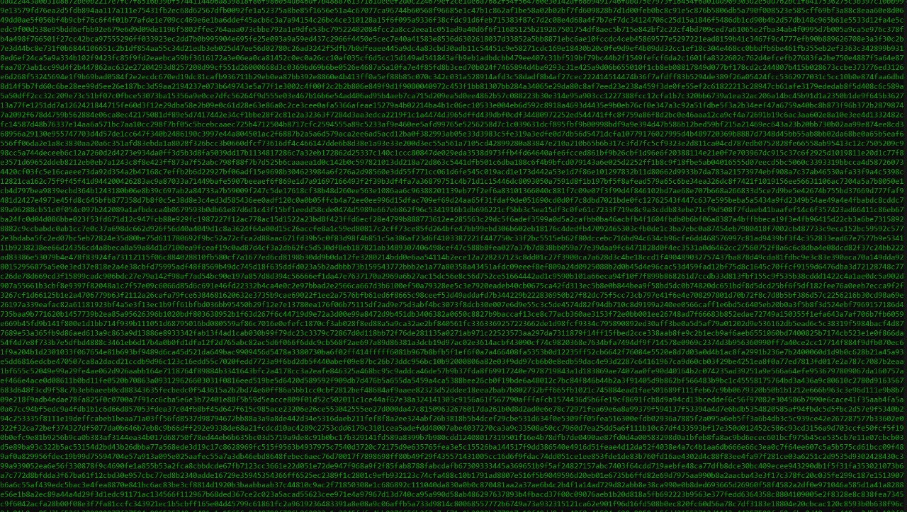

# 🚩🔥 Fake Hacker Interface 💻</br></br></br>

Welcome to the Fake Hacker Interface, a simple yet fun Python script that creates the illusion of a hacking session. </br>
Want to impress your friends, prank your coworkers, or just feel like a genius coder for a moment? Look no further!

## 🧩 How It Works
This script uses Python's secrets library to generate a massive stream of random hexadecimal numbers. </br>
When you run the program, it outputs an overwhelming amount of "coded data" that looks like it's performing intense hacking operations.</br>

## ⚙️ Code Overview


    import secrets
    bruh = secrets.token_hex(10000000)
    print(bruh)
    
</br>
## 🖼️ Result Overview</br>


</br>
To change the terminal text color to green in the Windows Command Prompt (CMD) directly</br>
Simply type the following in your Command Prompt:

     color 2
     

</br>

### 🔍 Explanation:
• secrets.token_hex(10000000): This generates 20,000,000 random hexadecimal characters. 
The 10000000 specifies the number of bytes, and each byte corresponds to two hexadecimal characters.</br>
• print(bruh): Prints the "fake data dump" on the screen, which looks like an important hacking operation.</br>

The output will fill your terminal with random hexadecimal gibberish, 
making it look like you're hacking into top-secret systems. 🚀
</br>

## 🖥️ How to Run

1. Clone the repository:
   ```bash
   git clone https://github.com/Oanekrif/Fake-Hack.git
2. Navigate to the project directory:
   ```bash
   cd Fake-Hack
3. Run the Python script:
   ```bash
   python main.py
4. Watch as the "hacker interface" floods your screen! 👾
</br>

## 🎭 Why Use This Script?
• Prank your friends with a realistic-looking hacker tool.</br>
• Look cool while you "hack" in front of others.</br>
• Learn Python basics: Great way to explore simple Python concepts like libraries and printing outputs.</br>

## 🚧 Disclaimer
This script is for fun and entertainment purposes only. </br>
It does not perform any actual hacking or security-related tasks. </br>
Use responsibly, and don't mislead anyone!</br>

## 🏷️ License
This project is open-source and free to use under the MIT License.</br></br>

---
### 🌟 Enjoy hacking... ! 😎
